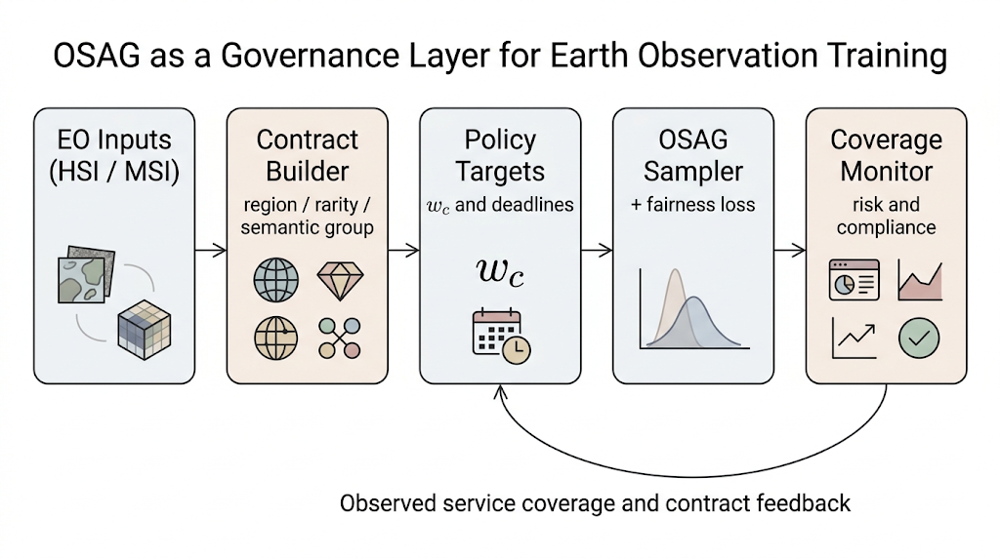
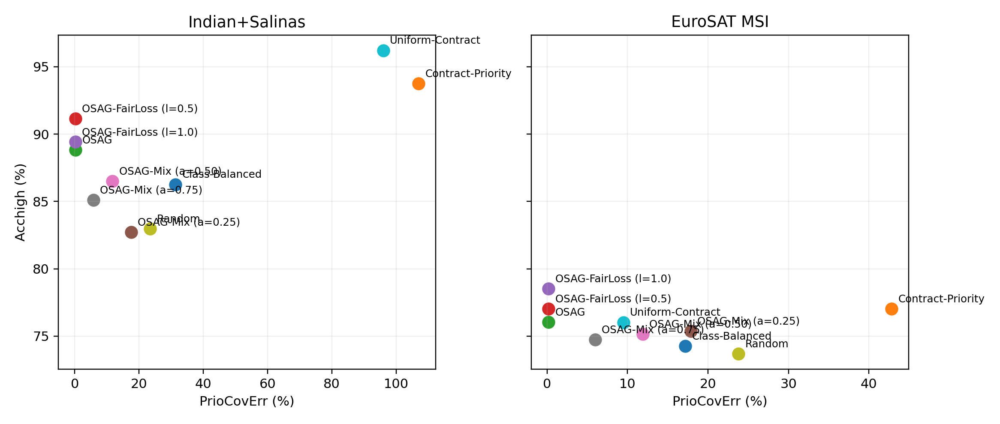
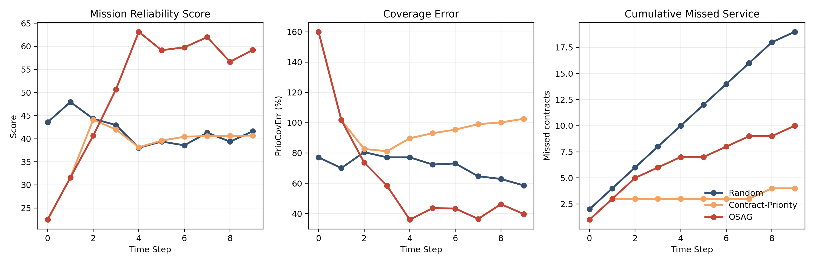
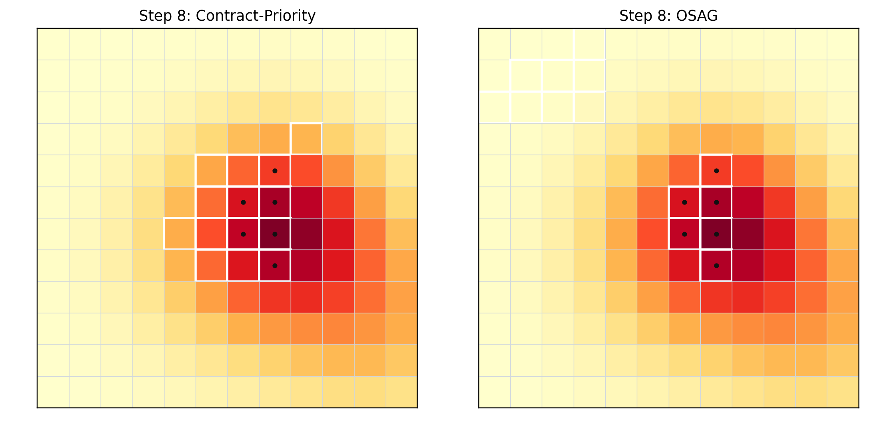

# OSAG EO Governance

OSAG EO Governance is a compact public release of the thesis-aligned pipeline for governance-aware Earth Observation learning. The repository packages two practical components:

- a script-driven rerun pipeline for contract-governed HSI and EuroSAT MSI experiments, and
- a runnable emergency dispatch demo that turns the same governance logic into a time-stepped operational system.

The project is centered on **Observed Service Agreement Graphs (OSAG)**, a governance layer that makes contract-level service targets explicit during training rather than leaving allocation to raw sample frequency.

## Highlights

- Contract-governed training over semantically meaningful service units.
- Fresh result snapshots aligned with the latest locked thesis benchmark.
- Lightweight benchmarking scripts that wrap standard classifiers rather than introducing a new backbone family.
- A browser-friendly dispatch demo for visualizing budgets, deadlines, coverage gaps, and missed service.

## Repository Layout

```text
osag-eo-governance/
|-- configs/
|-- dataset/
|-- docs/
|   `-- images/
|-- osag_demo/
|-- results_snapshot/
`-- scripts/
```

- `configs/` contains the experiment configuration used by the public release.
- `dataset/` is the expected location for canonical local inputs. Data are not redistributed here.
- `scripts/` contains the main rerun, download, runtime, and asset-generation utilities.
- `osag_demo/` contains the emergency dispatch simulation and dashboard entry points.
- `results_snapshot/` contains small thesis-aligned CSV snapshots for quick inspection.
- `docs/images/` contains figures used in this README.

## What This Release Covers

This public repository focuses on the main thesis-aligned workflow:

1. canonical data download and verification,
2. script-based rerun of the main benchmark,
3. runtime summarization and result-table generation,
4. dispatch-demo generation and visualization,
5. small result snapshots and documentation assets.

The repository is intentionally focused on the main public workflow rather than on every internal thesis-side utility.

## Environment

The original thesis reruns were executed in a CUDA-enabled Python 3.9 environment with PyTorch 2.8.0+cu128. The code can also run in any equivalent environment that satisfies the dependencies in `requirements.txt`.

Install dependencies:

```powershell
python -m venv .venv
.venv\Scripts\activate
pip install -r requirements.txt
```

## Canonical Data Layout

Place the formal inputs under `dataset/`:

- `dataset/Indian_pines_corrected.mat`
- `dataset/Indian_pines_gt.mat`
- `dataset/Salinas_corrected.mat`
- `dataset/Salinas_gt.mat`
- `dataset/EuroSAT_MS.zip`

You can also download the canonical sources directly with:

```powershell
python .\scripts\download_canonical_data.py --config .\configs\osag_real_experiments.yaml
```

For EuroSAT, the downloader verifies the official MD5 and extracts the archive to `data/raw/eurosat/`.

## Running the Main Benchmark

The default configuration is set up for the thesis-aligned five-seed main rerun.

```powershell
python .\scripts\run_all_real_experiments.py --config .\configs\osag_real_experiments.yaml --run-name rerun_main5
```

Key outputs will be written under:

- `results/raw/<run_name>/`
- `results/tables/<run_name>/`
- `results/figures/<run_name>/`
- `results/runtime/<run_name>/`
- `logs/<run_name>/`

## Running the Dispatch Demo

Generate the dispatch dashboard:

```powershell
python .\osag_demo\run_visual_demo.py
python .\osag_demo\launch_visual_demo.py
```

The demo writes its artifacts to `osag_demo/visual_outputs/`.

## Thesis-Aligned Result Snapshot

The `results_snapshot/` directory includes compact CSV exports from the locked thesis workspace:

- `fresh_main_results.csv`
- `runtime_summary.csv`
- `demo_dispatch_summary.csv`
- `demo_dispatch_contracts.csv`
- `eurosat_backbone_comparison.csv`

These files are included for inspection and documentation. They are not a substitute for rerunning the pipeline from canonical inputs.

## Selected Figures

### Governance Pipeline



### Benchmark Frontier



### Dispatch Timeline



### Dispatch Step Comparison



## Operational Interpretation

The dispatch demo is not a replacement for the benchmark. Its purpose is to visualize the operational consequence of governance:

- which contracts are being served,
- where coverage deviates from target,
- how deadline pressure changes behavior,
- and why explicit governance differs from both Random and heuristic Contract-Priority dispatch.

## Citation

If you use this code or the public release structure, please cite the associated thesis and the conference-paper lineage described in the thesis bibliography.

## License

This repository is released under the MIT License. See `LICENSE`.
